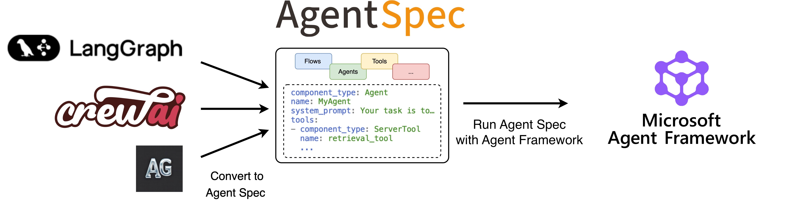

.. _agentframeworkadapter:

===============================================
Agent Spec Adapters - Microsoft Agent Framework
===============================================

    ↑ With the **Agent Spec adapter for Microsoft Agent Framework**, you can easily import agents from external frameworks using Agent Spec and run them with Agent Framework.

*Microsoft Agent Framework is a framework for building, orchestrating and deploying AI agents and multi-agent workflows*

Get started
===========

To get started, set up your Python environment (Python 3.10 or newer required),
and then install the PyAgentSpec package with the Microsoft Agent Framework extension.

.. code-block:: bash

    python -m venv .venv
    source .venv/bin/activate  # On Windows: .venv\Scripts\activate
    pip install "pyagentspec[agent-framework]"

Usage Examples
==============

You are now ready to use the adapter to:

.. toctree::
   :maxdepth: 1

   Run Agent Spec configurations with Microsoft Agent Framework <spec_to_agent_framework>
   Convert Microsoft Agent Framework agents to Agent Spec <agent_framework_to_spec>
