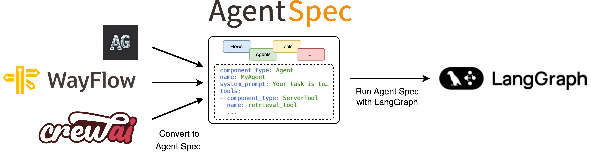

.. _langgraphadapter:

===============================
Agent Spec Adapters - LangGraph
===============================

    ↑ With the **Agent Spec adapter for LangGraph**, you can easily import agents from external frameworks using Agent Spec and run them with LangGraph.

*LangGraph facilitates the creation and management of long-running, stateful agents
with durable execution and human-in-the-loop capabilities.*

Get started
===========

To get started, set up your Python environment (Python 3.10 or newer required),
and then install the PyAgentSpec package with the LangGraph extension.

.. code-block:: bash

    python -m venv .venv
    source .venv/bin/activate  # On Windows: .venv\Scripts\activate
    pip install "pyagentspec[langgraph]"

You are now ready to use the adapter:

- Run Agent Spec configurations with LangGraph (see more details :ref:`below <spectolanggraph>`)
- Convert LangGraph agents to Agent Spec (see more details :ref:`below <langgraphtospec>`)

.. _spectolanggraph:

Run Agent Spec configurations with LangGraph
============================================

.. literalinclude:: ../code_examples/adapter_langgraph_quickstart.py
    :language: python
    :start-after: .. start-agentspec_to_runtime
    :end-before: .. end-agentspec_to_runtime

.. _langgraphtospec:

Convert LangGraph agents to Agent Spec
======================================

.. literalinclude:: ../code_examples/adapter_langgraph_quickstart.py
    :language: python
    :start-after: .. start-runtime_to_agentspec
    :end-before: .. end-runtime_to_agentspec
